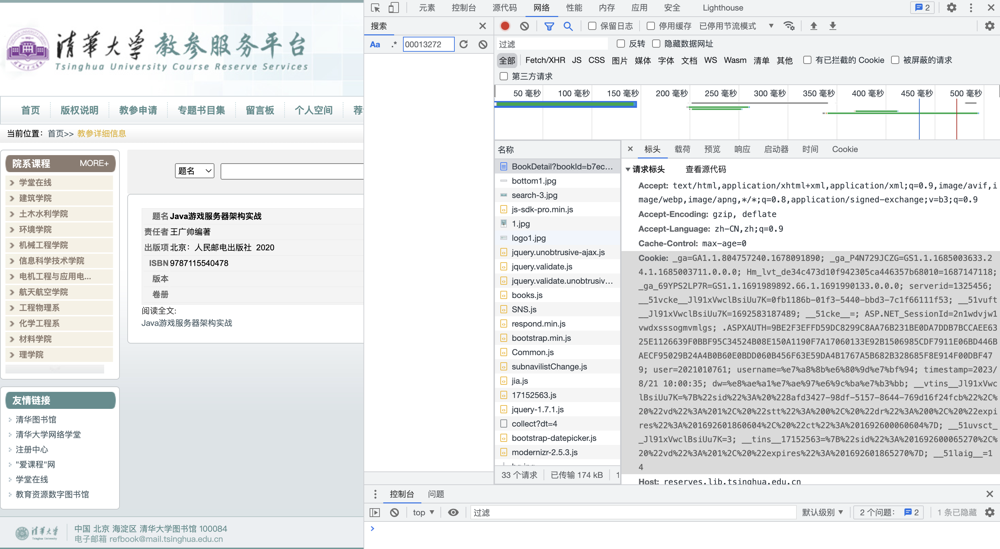

# THU-Book-Crawler

## 前言

此脚本**仅供方便清华师生学习之用**, 作者坚决反对批量下载书籍的违规行为, 请大家自觉维护版权, 合理使用资源.

## 使用说明

### 配置环境

版本为 **Python3**, 使用命令 ``pip install -r requirements.txt`` 安装依赖.

### 启动爬虫

1. 进入[清华教参平台](http://reserves.lib.tsinghua.edu.cn), 选择你需要下载的书籍, 这是一个[示例网址](http://reserves.lib.tsinghua.edu.cn/Search/BookDetail?bookId=b7ec90cc-cf6f-492d-a8be-5815bbf0115e).

2. 按下 `Fn` 与 `F12`, 打开开发者工具, 点击 “网络” 选项卡, 并刷新网页.

    

3. 点击图中所示的网络请求, 将请求标头中的 **User-Agent**、**Cookie** 以及网页 **url**、书籍名称填写在 `config.json` 中.

4. 在根目录下执行 `python main.py`, 将自动下载 **PDF** 并保存到 `example` 子目录.

## 联系方式

如有相关想法建议, 欢迎[联系作者](mailto:chengsx_thu@163.com), 恳请斧正.
